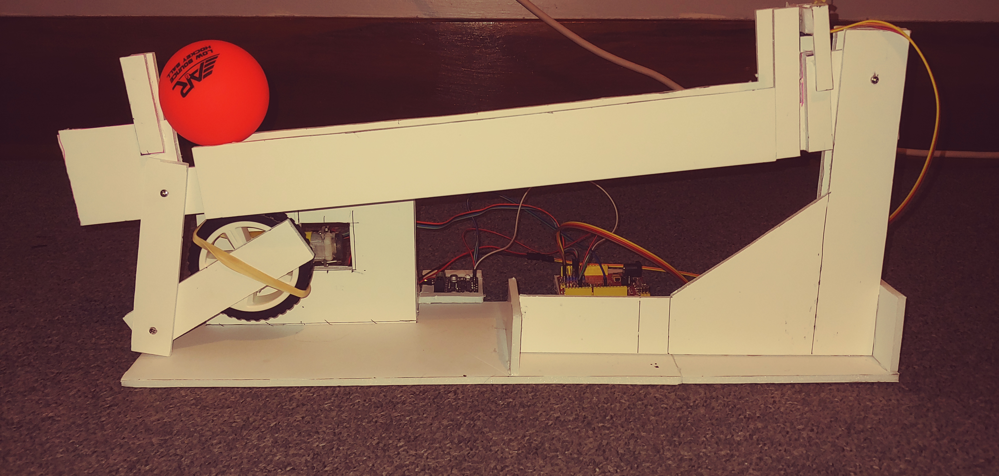

# Control Systems Portfolio Project - Ball on Beam System

## Introduction

In the Spring Semester of 2021 I took EEET-427, Control Systems. 

To wrap up the course, students had to complete a portfolio project. This project served several purposes: to re-enforce the concepts of control systems learned throughout the course, to document the student's learning of control systems, and to serve as an example of the work done throughout the semester.

## The Ball on Beam System

This project is pretty straight-forward: a beam, controlled by an Arduino Uno and driven by a DC motor, self-balances a ball in the center of the beam. The tricky part is getting the ball to the center of the beam, stabilizing it, and then accounting for disturbances and the beam's tendency to drift downwards due to the weight of the ball and the armature itself.
 
 
 

*The Full Ball on Beam System, in all its glory.*
 
 
The setup is relatively simple. A wheel is attached to the output shaft of a DC motor, which is then attached to two arms hinged at their far points. The other end of this upper arm is attached to the far side of the beam. The other end of the beam has a distance sensor mounted to it. The system is controlled by an Arduino Uno, with power supplied by a H-Bridge motor driver.

## The Learning Process

This project, and the course as a whole, came with a learning curve for me. Coming into the class, I had little to no experience with control system design or iterating on them. Although I felt comfortable with the software we used, I had mostly used them for data collection & representation, not as tools for simulation. While I definitely feel that I came into the course with a bit more knowledge than some of my peers, I was definitely pushed out of my comfort zone.

Coming into this class, I had experience with most of what i'd be interacting with, but not experience with the parts applicable to Control Systems. In previous courses, including one taken the semester before taking Control Systems, I had heavily used MATLAB, as well as the Arduino platform. Having a good grip on these allowed me to focus more on what I was here to learn, rather than trying to learn class material in parallel with learning software. I had used the Arduino platform, specifically the Arduino Uno, extensively before working on this probject. During one of my coop experiences, I had used an Uno to jerk a spring a certain distance to test out motor drivers. While it was not exactly transferrable to this project, the design of an Uno controlling a motor that in turn moved an armature, and then tuning that system, was familiar territory.

