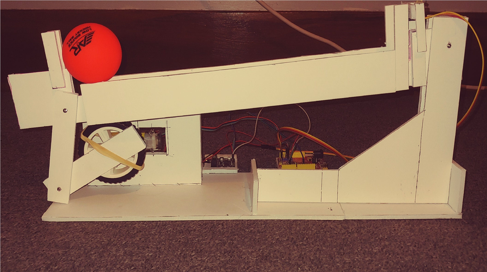

# Control Systems Portfolio Project - Ball on Beam System

## Introduction

In the Spring Semester of 2021 I took EEET-427, Control Systems. 

To wrap up the course, students had to complete a portfolio project. This project served several purposes: to re-enforce the concepts of control systems learned throughout the course, to document the student's learning of control systems, and to serve as an example of the work done throughout the semester.

## The Ball on Beam System

This project is pretty straight-forward: a beam, controlled by an Arduino Uno and driven by a DC motor, self-balances a ball in the center of the beam. The tricky part is getting the ball to the center of the beam, stabilizing it, and then accounting for disturbances and the beam's tendency to drift downwards due to the weight of the ball and the armature itself.
<br />
<br />
<br />

*The Full Ball on Beam System, in all its glory.*
<br />
<br />
The setup is relatively simple. A wheel is attached to the output shaft of a DC motor, which is then attached to two arms hinged at their far points. The other end of this upper arm is attached to the far side of the beam. The other end of the beam has a distance sensor mounted to it. The system is controlled by an Arduino Uno, with power supplied by a H-Bridge motor driver.


## Hitting the Ground Running

Coming into this class, I had experience with most of what i'd be interacting with, but not experience with the parts applicable to Control Systems. In previous courses, including one taken the semester before taking Control Systems, I had heavily used MATLAB, as well as the Arduino platform. Having a good grip on these allowed me to focus more on what I was here to learn, rather than trying to learn class material in parallel with learning software. I had used the Arduino platform, specifically the Arduino Uno, extensively before working on this probject. During one of my coop experiences, I had used an Uno to jerk a spring a certain distance to test out motor drivers. While it was not exactly transferrable to this project, the design of an Uno controlling a motor that in turn moved an armature, and then tuning that system, was familiar territory.
<br />
<br />
## The Learning Process
This project, and the course as a whole, came with a learning curve for me. Coming into the class, I had little to no experience with control system design or iterating on them. Although I felt comfortable with the software we used, I had mostly used them for data collection & representation, not as tools for simulation. While I definitely feel that I came into the course with a bit more knowledge than some of my peers, I was definitely pushed out of my comfort zone.

Something I've observed as a student and as a Laboratory Assistant is that students learn best from their peers - this continued to hold true in this class's weekly lab sections. I found that being able to share my design's progress with my peers, as well as being able to see what they had implemented, usually lead to everyone involved implementing changes into their designs. 


Something that commonly happened was suggesting various tuning values - at one point, I suggested using a much higher Kp value than suggested - 10 instead of the initial 1 - in the velocity function of our code. For the majority of people, this lead to a large and immediate change in performance, which could then be turned to each individual system.
<br />
<br />
```c++
float refVelPreFilter = Gc_mtrPos.U_PID(errPos, 20, 0.25, 2.0, 5, saturatedActuator); //errPos, Kp, Ki, Kd, Derivative_cutoff_freq_rps, saturatedActuator
```
*The code in question, with my finalized input values.*
<br />
<br />
While some changes were predictable and had standard responses in the system, some changes were not predicted. One particularly finnicky part of the code was the PID controller for motor position - small changes in any of the values (+/- 0.1) could make a large impact on the system's initial response, its steady state values, and the amount of steady state oscillation.


Before implementing the PID controllers, I was able to get  my system to a point that it was well tuned. Switching over to using the PID controllers for potentially better performance, was a bit daunting. While the benefits were there, hours had been spent simulating and tuning the initial system. While implementing the PID controllers was the correct choice, making the judgement call to throw away a fair amount of work was nonetheless stressful. The next step was to weigh the pros and cons of creating more models in matlab to find better values, versus iterating through by manually tuning.

## The Finalized System


*The working ball on beam system, including an added disturbance in the form of pushing the ball. Pushing the ball is fun.*
<br />
<br />
While it is by no means an exhaustive showing of all I learned from the class, this project pulled together several aspects of control systems. Iterative design, implementing feedback & feedforward designs, PID control, filtering, all of these are an important aspect to controls. One of my favorite aspects was seeing the direct impact of the iterative design process. Below is a graph showing two 20-second runs of the system, one before tuning and one after.
<br />

*The feedback across a 20-second long segment, one with untuned values and one after tuning.*
<br />
<br />
Notice that the tuning affected several aspects of the system's response: the tuned response has a faster response time, and less oscillation in steady state. It is also slightly quicker to respond to the disturbance, and corrects the ball back to the center faster. It is also slightly more accurate at reaching the correct reference distance of 200mm.

